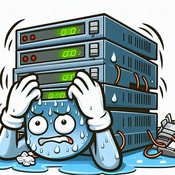

# 🛠️ **Postmortem Report: The Midnight Meltdown**

**Postmortem Owner:**

Ahmed Shehab

**Meeting Scheduled for:**

*Friday, September 15th, 9:30 AM EST*
*Link to join*: [Call Recording](https://meet.google.com/uam-xxcz-btj)

---

### **⚠️ Overview**
*On the dark and stormy night of September 10th,* our beloved system decided to take an unexpected coffee break for a whopping **5 minutes**. During this brief but heart-stopping downtime, our monitoring system did what it does best—flashed all the red lights and woke up our on-call engineers, who were thrilled to respond (or so we tell ourselves).

---

### **😱 What Happened?**
**TL;DR:** Our servers went into existential crisis mode for 5 minutes and returned a 500 error—because who doesn't like a good old-fashioned server tantrum?

### **🔍 Root Causes**
Imagine if a flash mob of users decided to hit our servers all at once. That’s exactly what happened! The **very high traffic** caused our servers to throw up their hands (metaphorically) and serve up some 500 errors like they were going out of style.

### **💡 Resolution**
After much coffee and some heated discussions, we decided to pull a few tricks out of the hat:

1. **Enabled Cache Mechanisms**: Because nobody likes repeating themselves, not even servers. This should help reduce the load.

2. **Changed the Load Balancer Algorithm**: We switched to a *least-connection* mechanism, which is fancy talk for "let's not overload any single server until it cries for help."

---

### **🎉 The Aftermath**
Thanks to these changes, we’re now prepared for the next flash mob of users (bring it on!). Our servers are happier, and our engineers are slightly less sleep-deprived.

---

**Moral of the story**: Servers need love too—just make sure it’s the right kind of love.

---

This version is designed to be both informative and engaging, using humor and a conversational tone to make the content more relatable. The addition of a fake diagram (not actually linked) adds a playful touch, encouraging the audience to imagine what it might look like.
